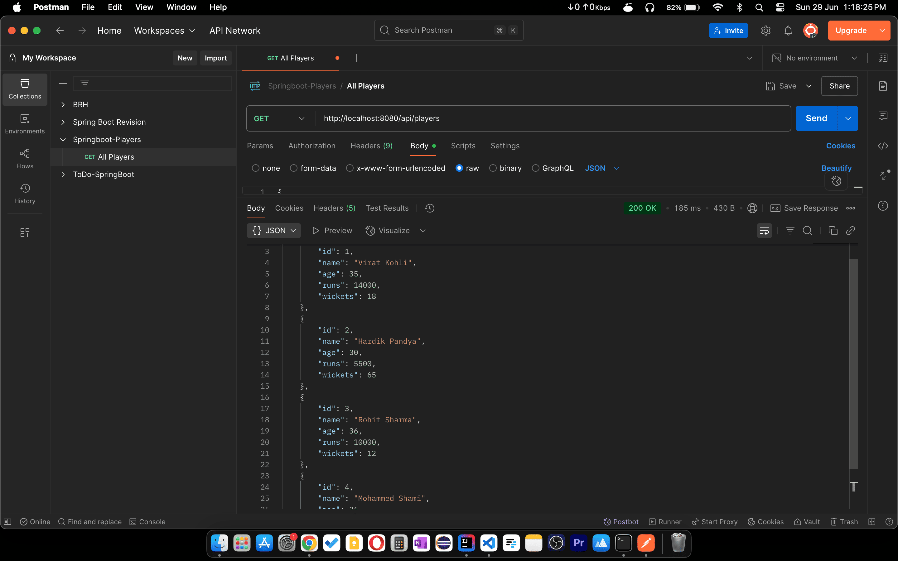
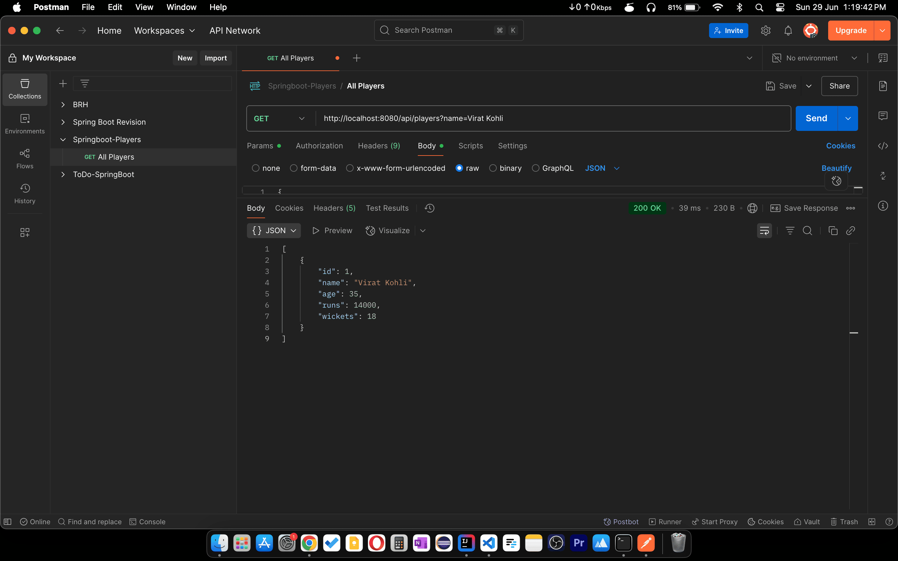
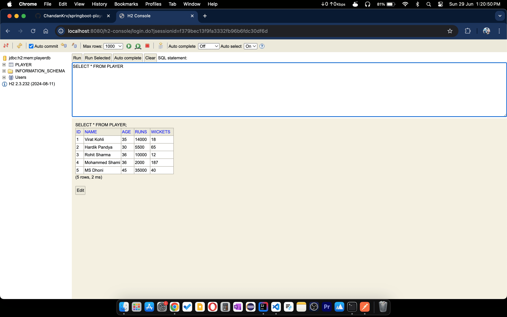

# Spring Boot Players API

A simple Spring Boot application that provides RESTful APIs to manage cricket players and their statistics using H2 in-memory database.

# APIs

### List all players 
* GET: ```http://localhost:8080/api/players```

### Filter with player name

* GET: ```http://localhost:8080/api/players?name=Virat Kohli```

### Add new players

* POST: ```http://localhost:8080/api/players```


# Screenshots
* Get All Players

* DB Status

* Filter with player's name

* Add new players

* DB Status after adding new player

* Get all players


